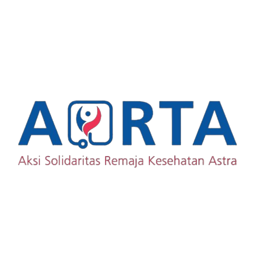
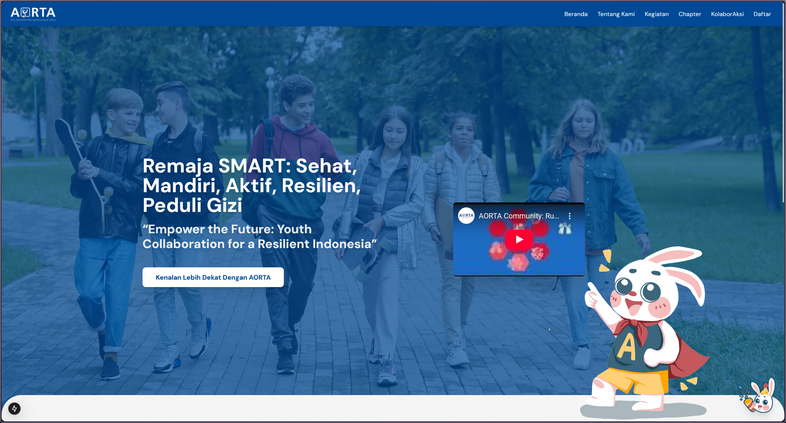

# AORTA Community - Website & Admin Panel

<p align="center">
  
</p>

Selamat datang di repositori resmi untuk website AORTA Community. Proyek ini dibangun menggunakan Next.js (App Router) dan terintegrasi penuh dengan Supabase sebagai backend, mencakup situs web publik yang informatif dan panel admin yang fungsional untuk manajemen konten.

## 📸 Tampilan

<p align="center">
  
</p>

---

## ✨ Fitur Utama

Proyek ini terbagi menjadi dua bagian utama: situs publik dan panel admin.

### Situs Publik

- **Halaman Dinamis**: Halaman untuk **Chapter**, **KolaborAksi**, dan **Kegiatan** yang mengambil data langsung dari database.
- **Galeri Kegiatan Interaktif**: Tampilan kegiatan dikelompokkan berdasarkan Chapter/Kolaborasi, dengan galeri foto _fullscreen_ yang interaktif.
- **Sistem Artikel**: Halaman untuk membaca artikel yang kontennya mendukung _rich text format_.
- **Chatbot Asisten**: Maskot AORTA di pojok kanan bawah yang berfungsi sebagai chatbot FAQ.
- **Desain Responsif**: Tampilan yang menyesuaikan diri dengan baik di perangkat mobile maupun desktop.

### Panel Admin (`/admin`)

- **Autentikasi Aman**: Login menggunakan Supabase Auth yang diamankan oleh Next.js Middleware dan Server Actions.
- **Manajemen Konten (CMS)**:
  - **Artikel**: Buat, lihat, edit, dan hapus artikel dengan _rich text editor_ (Lexical).
  - **Kegiatan**: Tambah kegiatan baru dengan **upload multi-gambar** sekaligus, lalu hubungkan dengan Chapter atau Kolaborasi tertentu.
  - **Chapter & KolaborAksi**: Tambah data master untuk Chapter dan Mitra Kolaborasi baru.
- **Pencarian & Filter**: Fungsionalitas pencarian dan filter di halaman daftar artikel.

---

## 🛠️ Teknologi yang Digunakan

- **Framework**: [Next.js](https://nextjs.org/) (App Router)
- **Backend & Database**: [Supabase](https://supabase.io/) (Postgres, Auth, Storage)
- **Styling**: [Tailwind CSS](https://tailwindcss.com/)
- **UI & Ikon**: React, [Lucide React](https://lucide.dev/)
- **Editor Teks**: [Lexical](https://lexical.dev/)
- **Upload File**: [React Dropzone](https://react-dropzone.js.org/)
- **Notifikasi**: [React Hot Toast](https://react-hot-toast.com/)

---

## 🚀 Memulai Proyek Secara Lokal

Ikuti langkah-langkah ini untuk menjalankan proyek di mesin lokal Anda.

### 1. Prasyarat

- Node.js (versi 18.x atau lebih tinggi)
- npm / yarn / pnpm
- Akun Supabase

### 2. Konfigurasi Awal

1.  **Clone repositori ini:**
    ```bash
    git clone https://github.com/udinnn/astra-blog-project.git
    cd repo-name
    ```
2.  **Install dependensi:**
    ```bash
    npm install
    ```
3.  **Siapkan Supabase:**
    - Buat proyek baru di [dashboard Supabase](https://app.supabase.com/).
    - **Buat Tabel**: Masuk ke **Table Editor** dan buat tabel-tabel berikut sesuai skema yang dibutuhkan:
      - `chapters` (id, name, image_url, chapter_date)
      - `collaborations` (id, partner_name, image_url, collaboration_date)
      - `articles` (id, title, content, image_url, publish_date, publish_type, target_name)
      - `kegiatan` (id, title, activity_date, publish_type, target_id)
      - `kegiatan_images` (id, image_url, kegiatan_id)
    - **Buat Storage Bucket**: Masuk ke **Storage**, buat Bucket baru bernama `aorta-public-images` dan pastikan bucket tersebut bersifat **Public**.

### 3. Konfigurasi Environment Variables

1.  Buat file baru bernama `.env.local` di root proyek.
2.  Salin isi dari file `.env.example` (jika ada) atau gunakan template di bawah.
3.  Ambil **Project URL** dan **anon public key** dari dashboard Supabase Anda (**Settings > API**).

    ```.env.local
    NEXT_PUBLIC_SUPABASE_URL="[https://your-project-url.supabase.co](https://your-project-url.supabase.co)"
    NEXT_PUBLIC_SUPABASE_ANON_KEY="your-anon-public-key"
    ```

### 4. Jalankan Aplikasi

- Jalankan server development:
  ```bash
  npm run dev
  ```
- Buka [http://localhost:3000](http://localhost:3000) di browser Anda.

---

## 📁 Struktur Proyek

Berikut adalah gambaran umum struktur folder utama:

```
/
├── app/                  # Semua rute dan halaman (App Router)
│   ├── admin/            # Halaman dan layout khusus panel admin
│   ├── kegiatan/         # Halaman indeks dan detail kegiatan
│   │   └── [slug]/
│   ├── (halaman-lain)/   # Rute lain seperti /about, /chapter, dll.
│   ├── layout.js         # Layout utama
│   └── page.js           # Halaman utama (Homepage)
│
├── components/           # Komponen React yang dapat digunakan kembali
│   ├── ui/               # Komponen UI kecil (Button, Card, Modal, dll.)
│   └── (komponen-utama)  # Komponen besar seperti Header, Footer, Sidebar, dll.
│
└── utils/                # Utilitas, termasuk konfigurasi Supabase client
```
